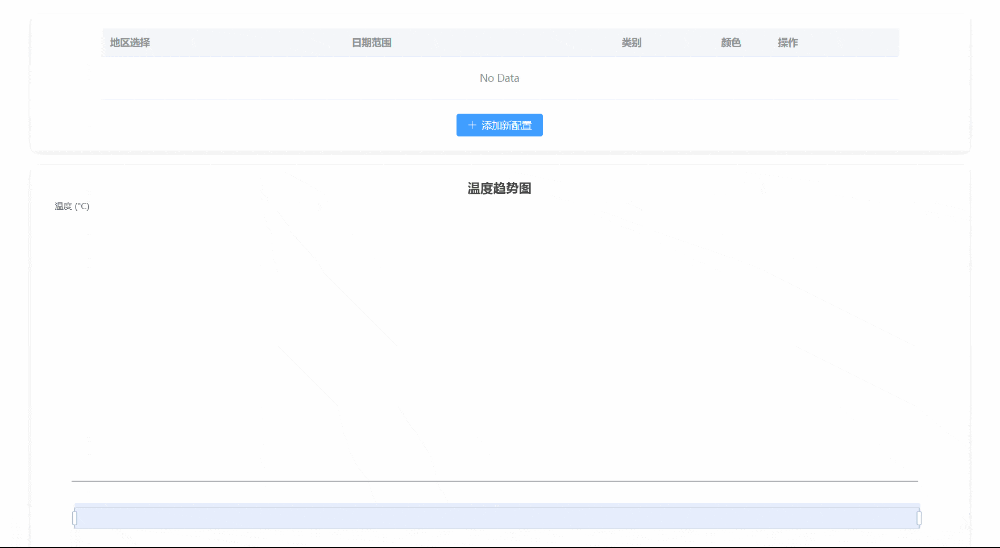

# Temperature Tracker

一个用于展示不同地区历史气温趋势的 Web 应用。



## 功能特性

- 三级联动地区选择
- 日期范围选择
- 多折线图表展示
- 支持多地区数据对比
- 本地数据缓存
- 响应式设计

## 技术栈

- Vue 3
- TypeScript
- Element Plus
- Vite
- Pinia
- ECharts
- Axios

## 项目结构

```
src/
├── assets/ # 静态资源
├── components/ # 组件
│ ├── DateRangePicker.vue # 日期范围选择器
│ ├── LineConfig.vue # 折线配置
│ ├── RegionSelector.vue # 地区选择器
│ └── TempChart.vue # 温度图表
├── config/ # 配置文件
│ └── constants.ts # 常量配置
├── data/ # 数据文件
│ ├── cityData.ts # 城市数据处理
│ └── citySelectData.ts # 城市选择数据
├── stores/ # 状态管理
│ ├── region.ts # 地区状态
│ └── temperature.ts # 温度数据状态
├── types/ # 类型定义
│ ├── index.ts # 类型导出
│ ├── region.ts # 地区相关类型
│ ├── shims-citydata.d.ts # 城市数据类型声明
│ └── temperature.ts # 温度数据类型
├── utils/ # 工具函数
│ ├── apiClient.ts # API 客户端
│ ├── cacheUtils.ts # 缓存工具
│ ├── dateUtils.ts # 日期工具
│ └── weatherApi.ts # 天气 API
├── App.vue # 根组件
├── main.ts # 应用入口
├── style.css # 全局样式
└── vite-env.d.ts # Vite 环境类型声明

```

## 核心功能实现

#### 1. 地区选择 (RegionSelector.vue)
- 实现省/市/区三级联动选择
- 特殊处理直辖市显示逻辑，直辖市会显示为"省-市-区"的形式（如：北京-北京-朝阳）特别行政区同样遵循三级结构
- 支持地区名称和编码的双向绑定
- 使用 Element Plus 的 Cascader 组件实现

#### 2. 日期范围选择 (DateRangePicker.vue)
- 开始日期和结束日期选择（最大48个月）
- 禁用未来日期
- 使用 Element Plus 的 DatePicker 组件
- 内置快捷选项（最近一个月/半年/一年）

#### 3. 折线配置 (LineConfig.vue)
- 颜色选择器集成
- 温度类型选择（最高/最低）
- 操作按钮支持（删除、复制、下载）
- 动态添加新配置行

#### 4. 温度图表 (TempChart.vue)
- 使用 ECharts 绘制折线图
- 支持多折线展示
- 图例显示
- 交互功能（数据提示、缩放等）


## 运行项目

```bash
# 安装依赖
npm install

# 启动开发服务器
npm run dev

# 构建生产版本
npm run build
```

